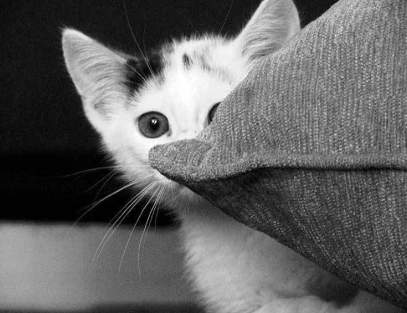

# 🐱 Random Cat Image Loader
<p align="center">
  

</p>

This project fetches a random cat image from **The Cat API** and updates an `` element on the webpage when a button is clicked.

🔗 **Live Demo**: [Random Cat Image Loader](https://alexsand-r.github.io/just-a--cat/)

## 📌 Features

✅ Fetches a new cat image on button click  
✅ Uses **JavaScript Fetch API** to get data from The Cat API  
✅ Handles errors gracefully with an alert  

## 🚀 How to Use

1. **Clone the Repository**  

   ```bash
   git clone https://github.com/your-username/repository-name.git

🛠️ Technologies Used
JavaScript – For handling the logic and fetching data from the API.
Fetch API – For making network requests to the Cat API.
HTML – For building the structure of the page.
CSS – For styling the application

   💡 Feel free to explore the project and contribute! 🚀
🔗 **Live Demo**: [Random Cat Image Loader](https://alexsand-r.github.io/just-a--cat/)
📫 Contact Me:
1inboxna@gmail.com
